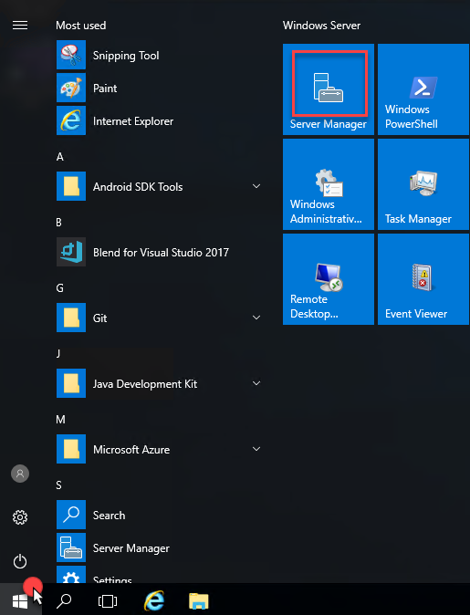
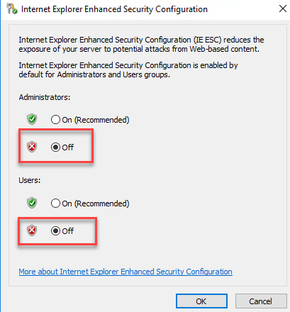
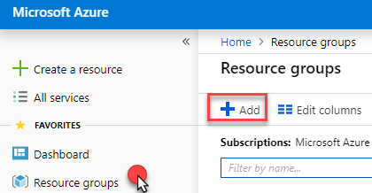
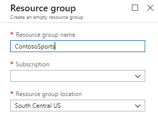

Modern cloud apps

Before the hands-on lab setup guide

November 2018

Information in this document, including URL and other Internet Web site references, is subject to change without notice. Unless otherwise noted, the example companies, organizations, products, domain names, e-mail addresses, logos, people, places, and events depicted herein are fictitious, and no association with any real company, organization, product, domain name, e-mail address, logo, person, place or event is intended or should be inferred. Complying with all applicable copyright laws is the responsibility of the user. Without limiting the rights under copyright, no part of this document may be reproduced, stored in or introduced into a retrieval system, or transmitted in any form or by any means (electronic, mechanical, photocopying, recording, or otherwise), or for any purpose, without the express written permission of Microsoft Corporation.

Microsoft may have patents, patent applications, trademarks, copyrights, or other intellectual property rights covering subject matter in this document. Except as expressly provided in any written license agreement from Microsoft, the furnishing of this document does not give you any license to these patents, trademarks, copyrights, or other intellectual property.

The names of manufacturers, products, or URLs are provided for informational purposes only and Microsoft makes no representations and warranties, either expressed, implied, or statutory, regarding these manufacturers or the use of the products with any Microsoft technologies. The inclusion of a manufacturer or product does not imply endorsement of Microsoft of the manufacturer or product. Links may be provided to third party sites. Such sites are not under the control of Microsoft and Microsoft is not responsible for the contents of any linked site or any link contained in a linked site, or any changes or updates to such sites. Microsoft is not responsible for webcasting or any other form of transmission received from any linked site. Microsoft is providing these links to you only as a convenience, and the inclusion of any link does not imply endorsement of Microsoft of the site or the products contained therein.

© 2018 Microsoft Corporation. All rights reserved.

Microsoft and the trademarks listed at <https://www.microsoft.com/en-us/legal/intellectualproperty/Trademarks/Usage/General.aspx> are trademarks of the Microsoft group of companies. All other trademarks are property of their respective owners.# Modern Cloud Apps setup

**Contents**

<!-- TOC -->

- [Modern cloud apps before the hands-on lab setup guide](#modern-cloud-apps-before-the-hands-on-lab-setup-guide)
    - [Requirements](#requirements)
    - [Before the hands-on lab](#before-the-hands-on-lab)
        - [Task 1: Setup a development environment](#task-1-setup-a-development-environment)
        - [Task 2: Disable IE Enhanced Security](#task-2-disable-ie-enhanced-security)
        - [Task 3: Install SQL Server Management Studio](#task-3-install-sql-server-management-studio)
        - [Task 4: Validate connectivity to Azure](#task-4-validate-connectivity-to-azure)
        - [Task 5: Download and explore the Contoso Sports League sample](#task-5-download-and-explore-the-contoso-sports-league-sample)
        - [Task 6: Create a new Azure Resource Group](#task-6-create-a-new-azure-resource-group)

<!-- /TOC -->

# Modern cloud apps before the hands-on lab setup guide 

## Requirements

-   Microsoft Azure subscription

-   Local machine or Azure virtual machine configured with:

    -   Visual Studio 2017 Community Edition or later

## Before the hands-on lab

Duration: 30 minutes

Before initiating the hands-on lab, you will setup an environment to use for the rest of the exercises.

### Task 1: Setup a development environment

1.  Create a virtual machine in Azure using the Visual Studio Community 2017 with the **latest release** on Windows Server 2016 image.
    - **Name**: Whatever you want
    - **User Name**: whatever you want
    - **Password**: Your choice, but make note of it
    - **Networking**: You may want to enable RDP (port 3389) for Remote Desktop access.

    

>**Note**: It is **highly** recommended to use a DS2 or D2 instance size for this VM.

### Task 2: Disable IE Enhanced Security

>**Note**: Sometimes this image has IE ESC already disabled, and sometimes it does not.

1.  Connect and log on to the new VM you just created, click **Start** and then then **Server Manager** if not already started.

    

2.  Select **Local Server**.

    

3.  On the right side of the pane, click **On** by IE Enhanced Security Configuration.

    

4.  Change to **Off** for Administrators, and select **OK**.

    

### Task 3: Install SQL Server Management Studio

1.  On the new VM, download and install the latest version of SQL Server Management Studio from the URL below: [17.9.x as of Nov 2018]. This may take 15-20 minutes.

    <https://msdn.microsoft.com/en-us/library/mt238290.aspx>

### Task 4: Validate connectivity to Azure

1.  Within your new virtual machine, launch Visual Studio, and validate you can login with your Microsoft Account when prompted.

2.  Validate connectivity to your Azure subscription. Launch Visual Studio, open Server Explorer from the View menu, and ensure that you can connect to your Azure subscription. Right click on Azure and select **Connect to Microsoft Azure Subscription**. Enter your credentials when prompted.

    

### Task 5: Download and explore the Contoso Sports League sample

1.  Create a new folder on your C: drive named **MCW**.

2.  Download the sample application from here: <https://github.com/Microsoft/MCW-Modern-cloud-apps/tree/master/Hands-on%20lab/Lab-files/Modern%20Cloud%20Apps%20Student%20Files.zip>  and extract to the newly created **MCW** folder.

3.  From the **Contoso Sports League** folder under **MCW**, open the Visual Studio Solution file: **Contoso.Apps.SportsLeague.sln**.

4.  The solution contains the following projects:

    |    |            |
    |----------|:-------------:|
    | Contoso.Apps.SportsLeague.Web |   Contoso Sports League e-commerce application |
    | Contoso.Apps.SportsLeague.Admin |   Contoso Sports League call center admin application |
    | Contoso.Apps.SportsLeague.Data  |   Data tier |
    | Contoso.Apps.SportsLeague.Offers |  API for returning list of available products |
    | Contoso.Apps.PaymentGateway   |     API for payment processing |

### Task 6: Create a new Azure Resource Group

1.  Within the Azure Management Portal, open the **Resource groups** tile and then select **+Add**.

    

2.  Specify the name of the resource group as **contososports**, and choose the Azure region into which you want to deploy the lab. This resource group will be used throughout the remainder of this Modern Cloud App lab. Click on **Create** to create the resource group.

    

You should follow all steps provided *before* performing the Hands-on lab.
