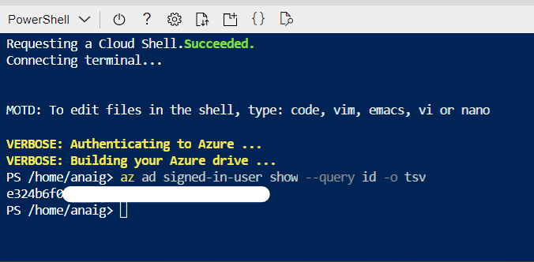
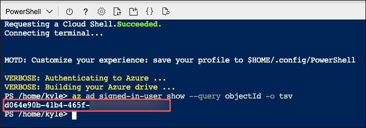
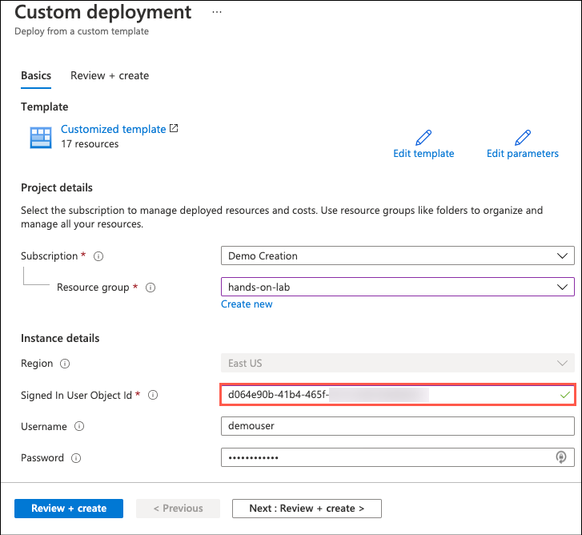
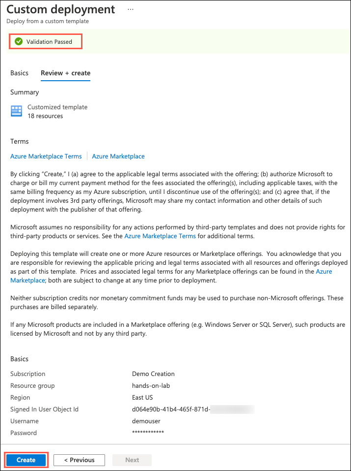
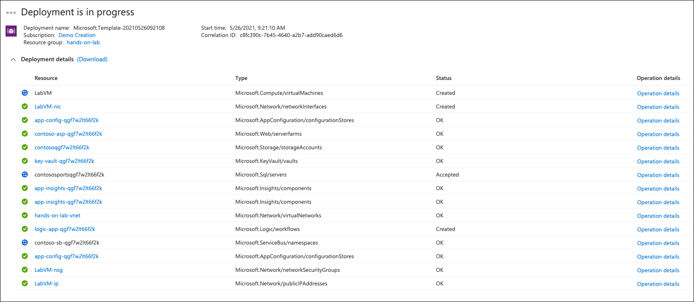

<div class="MCWHeader1">
Modern cloud apps
</div>

<div class="MCWHeader2">
Before the hands-on lab setup guide
</div>

<div class="MCWHeader3">
December 2021
</div>

Information in this document, including URL and other Internet Web site references, is subject to change without notice. Unless otherwise noted, the example companies, organizations, products, domain names, e-mail addresses, logos, people, places, and events depicted herein are fictitious, and no association with any real company, organization, product, domain name, e-mail address, logo, person, place or event is intended or should be inferred. Complying with all applicable copyright laws is the responsibility of the user. Without limiting the rights under copyright, no part of this document may be reproduced, stored in or introduced into a retrieval system, or transmitted in any form or by any means (electronic, mechanical, photocopying, recording, or otherwise), or for any purpose, without the express written permission of Microsoft Corporation.

Microsoft may have patents, patent applications, trademarks, copyrights, or other intellectual property rights covering subject matter in this document. Except as expressly provided in any written license agreement from Microsoft, the furnishing of this document does not give you any license to these patents, trademarks, copyrights, or other intellectual property.

The names of manufacturers, products, or URLs are provided for informational purposes only and Microsoft makes no representations and warranties, either expressed, implied, or statutory, regarding these manufacturers or the use of the products with any Microsoft technologies. The inclusion of a manufacturer or product does not imply endorsement of Microsoft of the manufacturer or product. Links may be provided to third party sites. Such sites are not under the control of Microsoft and Microsoft is not responsible for the contents of any linked site or any link contained in a linked site, or any changes or updates to such sites. Microsoft is not responsible for webcasting or any other form of transmission received from any linked site. Microsoft is providing these links to you only as a convenience, and the inclusion of any link does not imply endorsement of Microsoft of the site or the products contained therein.

© 2021 Microsoft Corporation. All rights reserved.

Microsoft and the trademarks listed at <https://www.microsoft.com/en-us/legal/intellectualproperty/Trademarks/Usage/General.aspx> are trademarks of the Microsoft group of companies. All other trademarks are property of their respective owners.# Modern Cloud Apps setup

**Contents**

<!-- TOC -->

- [Modern cloud apps before the hands-on lab setup guide](#modern-cloud-apps-before-the-hands-on-lab-setup-guide)
  - [Requirements](#requirements)
  - [Before the hands-on lab](#before-the-hands-on-lab)
    - [Task 1: Create a resource group](#task-1-create-a-resource-group)
    - [Task 2: Run ARM template to provision lab resources](#task-2-run-arm-template-to-provision-lab-resources)

<!-- /TOC -->

# Modern cloud apps before the hands-on lab setup guide

## Requirements

- Microsoft Azure MSDN subscription
- You must have permissions within your Azure Subscription and Azure Active Directory (Azure AD) to create users and setup Azure AD B2C.

## Before the hands-on lab

**Duration**: 20 minutes

In this exercise, you set up your environment for use in the rest of the hands-on lab. You should follow all steps provided _before_ attending the hands-on lab.

> **Important**: Many Azure resources require globally unique names. Throughout these steps, `XXXXX` appears as part of resource names. You should replace this with your Microsoft alias, initials, or another value to ensure uniquely named resources.

### Task 1: Create a resource group

In this task, you create an Azure resource group to serve as a container for the resources you will use throughout this hands-on lab.

1. In the [Azure portal](https://portal.azure.com), select **Resource groups** from the Azure services list.

   

2. On the Resource groups blade, select **Add**.

   

3. On the Create a resource group **Basics** tab, enter the following:

   - **Subscription**: Select the subscription you are using for this hands-on lab.
   - **Resource group**: Enter `hands-on-lab-XXXXX` as the name of the new resource group, where `XXXXX` is a unique suffix, such as your initials or a random number used to ensure a unique resource group name.
   - **Region**: Select the region you are using for this hands-on lab.

   

4. Select **Review + Create**.

5. On the **Review + create** tab, ensure the Validation passed message is displayed and then select **Create**.

### Task 2: Run ARM template to provision lab resources

In this task, you run an Azure Resource Manager (ARM) template to create the hands-on lab's resources. In addition to creating resources, the ARM template also executes a PowerShell script on the `LabVM` to install software and configure the server. The resources created by the ARM template include:

- [Azure App Configuration](https://docs.microsoft.com/azure/azure-app-configuration/overview)
- [Application Insights](https://docs.microsoft.com/azure/azure-monitor/app/app-insights-overview)
- [Azure Logic Apps](https://docs.microsoft.com/azure/logic-apps/logic-apps-overview)
- [Azure SQL Database](https://docs.microsoft.com/azure/azure-sql/database/sql-database-paas-overview)
- [Azure Key Vault](https://docs.microsoft.com/azure/key-vault/general/overview)
- [App Service Plan](https://docs.microsoft.com/azure/app-service/overview-hosting-plans)
- [Web App](https://docs.microsoft.com/azure/app-service/overview)
- [Azure Storage account](https://docs.microsoft.com/azure/storage/common/storage-account-overview)
- [Service Bus namespace](https://docs.microsoft.com/azure/service-bus-messaging/service-bus-messaging-overview)
- [Virtual network](https://docs.microsoft.com/azure/virtual-network/virtual-networks-overview) with `default` subnet
- [Virtual machine using the Visual Studio 2019 (Latest) Community Edition image](https://docs.microsoft.com/azure/virtual-machines/windows/using-visual-studio-vm)
  - Uses custom script extension to
    - Disable **IE Enhanced Security Configuration**
    - Download starter solution from Serverless architecture MCW GitHub repo
    - Download and install Azure Data Studio
    - Download and install Microsoft Edge browser
- [Network security group](https://docs.microsoft.com/azure/virtual-network/network-security-groups-overview) for VM
- [Network interface](https://docs.microsoft.com/azure/virtual-network/virtual-network-network-interface) for VM
- [Public IP address](https://docs.microsoft.com/azure/virtual-network/public-ip-addresses) for VM

1. Select the following **Deploy to Azure** button to deploy the ARM Template with the Lab VM resources for this lab. This link will deep link into the Azure Portal, passing in the ARM Template for deploying the resources for this lab.

    <a href ="https://portal.azure.com/#create/Microsoft.Template/uri/https%3A%2F%2Fraw.githubusercontent.com%2Fmicrosoft%2FMCW-Modern-cloud-apps%2Fmaster%2FHands-on%20lab%2Flab-files%2Farm-template%2Fazure-deploy.json" target="_blank" title="Deploy to Azure">
        
    </a>

2. On the custom deployment screen, the first parameter you need to populate is the `ObjectId` associated with the account you used to log into the Azure portal. To retrieve this, select the **Cloud Shell** icon on the Azure portal toolbar to open an Azure command line interface (CLI) terminal window at the bottom of your open browser window.

   

3. In the PowerShell terminal window that opens in the Azure portal, enter the following command at the prompt:

   ```powershell
   az ad signed-in-user show --query objectId -o tsv
   ```

   

4. Execute the command and copy the output value.

   

5. Now, on the custom deployment screen in the Azure portal, enter the following:

   - **Subscription**: Select the subscription you are using for this hands-on lab.
   - **Resource group**: Select the hands-on-lab-XXXXXX resource group from the dropdown list.
   - **Signed In User Object Id**: Paste the value you copied above from the cloud shell terminal command output.
   - **Username**: Accept the default value, **demouser**.
   - **Password**: Accept the default value, **Password.1!!**.

   

6. Select **Review + create** to review the custom deployment.

   > **Note**: The ARM template will append a hyphen followed by a 13-digit string at the end of resource names. This suffix ensures globally unique names for resources. We will ignore that string when referring to resources throughout the lab.

7. On the Review + create blade, ensure the _Validation passed_ message is displayed and then select **Create** to begin the custom deployment.

   > **Note**: The deployment of the custom ARM template should finish in about 15 minutes.

   

8. You can monitor the deployment's progress on the **Deployment** blade that opens when you start the ARM template deployment.

    

You should follow all the steps provided *before* performing the Hands-on lab.
