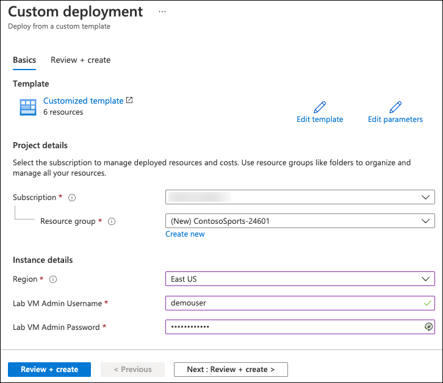
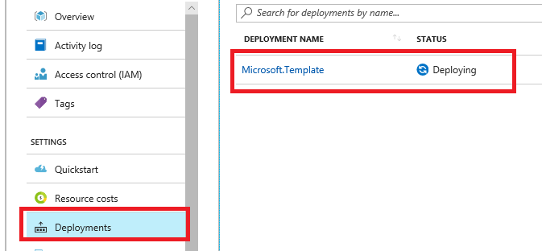
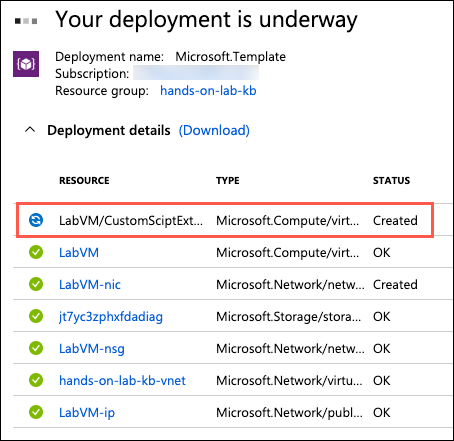

Modern cloud apps

Before the hands-on lab setup guide

November 2020

Information in this document, including URL and other Internet Web site references, is subject to change without notice. Unless otherwise noted, the example companies, organizations, products, domain names, e-mail addresses, logos, people, places, and events depicted herein are fictitious, and no association with any real company, organization, product, domain name, e-mail address, logo, person, place or event is intended or should be inferred. Complying with all applicable copyright laws is the responsibility of the user. Without limiting the rights under copyright, no part of this document may be reproduced, stored in or introduced into a retrieval system, or transmitted in any form or by any means (electronic, mechanical, photocopying, recording, or otherwise), or for any purpose, without the express written permission of Microsoft Corporation.

Microsoft may have patents, patent applications, trademarks, copyrights, or other intellectual property rights covering subject matter in this document. Except as expressly provided in any written license agreement from Microsoft, the furnishing of this document does not give you any license to these patents, trademarks, copyrights, or other intellectual property.

The names of manufacturers, products, or URLs are provided for informational purposes only and Microsoft makes no representations and warranties, either expressed, implied, or statutory, regarding these manufacturers or the use of the products with any Microsoft technologies. The inclusion of a manufacturer or product does not imply endorsement of Microsoft of the manufacturer or product. Links may be provided to third party sites. Such sites are not under the control of Microsoft and Microsoft is not responsible for the contents of any linked site or any link contained in a linked site, or any changes or updates to such sites. Microsoft is not responsible for webcasting or any other form of transmission received from any linked site. Microsoft is providing these links to you only as a convenience, and the inclusion of any link does not imply endorsement of Microsoft of the site or the products contained therein.

© 2020 Microsoft Corporation. All rights reserved.

Microsoft and the trademarks listed at <https://www.microsoft.com/en-us/legal/intellectualproperty/Trademarks/Usage/General.aspx> are trademarks of the Microsoft group of companies. All other trademarks are property of their respective owners.# Modern Cloud Apps setup

**Contents**

<!-- TOC -->

- [Modern cloud apps before the hands-on lab setup guide](#modern-cloud-apps-before-the-hands-on-lab-setup-guide)
  - [Requirements](#requirements)
  - [Before the hands-on lab](#before-the-hands-on-lab)
    - [Task 1: Deploy Lab VM Resources to Azure](#task-1-deploy-lab-vm-resources-to-azure)
    - [Task 2: Deploy Environment Resources to Azure](#task-2-deploy-environment-resources-to-azure)

<!-- /TOC -->

# Modern cloud apps before the hands-on lab setup guide

## Requirements

- Microsoft Azure MSDN subscription

  - You will need permissions within the Azure Subscription and Azure Active Directory (Azure AD) to create users and setup Azure AD B2C.

- Local machine or Azure virtual machine configured with:

  - Visual Studio 2019 Community Edition or later
  - Windows Server 2019

## Before the hands-on lab

Duration: 30 minutes

Before initiating the hands-on lab, you will setup an environment to use for the rest of the exercises.

### Task 1: Deploy Lab VM Resources to Azure

1. Select the following **Deploy to Azure** button to deploy the ARM Template with the Lab VM resources for this lab. This link will deep link into the Azure Portal, passing in the ARM Template for deploying the resources for this lab.

    

2. On the **Custom deployment** blade, enter the following:

    **Subscription**:

    - **Subscription**: Select the subscription you are using for this hands-on lab.
    - **Resource group**: Select **Create new** and enter `ContosoSports-XXXXX`, where `XXXXX` is a unique suffix, such as your initials or a random number used to ensure a unique resource group name.

    > **Note**: For this lab, it is recommended you use the **East US**, **North Europe**, or **Australia East** Azure regions. There are certain Azure regions that don't support all the resources provisioned by the ARM Templates used by this hands-on lab.

    **Instance details**:

    - **Region**: Select the region you would like to use for this hands-on lab.
    - **Lab VM Admin Username**: Accept the default value of `demouser`.
    - **Lab VM Admin Password**: Accept the default value of `demo@pass123`.

3. Select **Review + create**.

    

4. Once validation has succeeded, select the **Create** button.

5. The deployment will take 15-30 minutes to complete. Continue to the next Task while this is deploying.

    To view the progress, select the **Deployments** link, then select the **Microsoft.Template** deployment.

    

    > **Note**: A configuration script to install SSMS and the requires lab files will run after the deployment of the LabVM completes. The task will be listed on the deployment progress screen as `LabVM/CustomScriptExtension`. You should wait for this task to complete before attempting to log into the LabVM in the next task, as it downloads and installs files you will need.
    >
    > 

### Task 2: Deploy Environment Resources to Azure

1. Select the following **Deploy to Azure** button to deploy the ARM Template with the Environment resources for this lab. This link will deep link into the Azure Portal, passing in the ARM Template for deploying the resources for this lab.

    

    >**Note**: If you have issues with the **Deploy to Azure** link, then do a new **Custom deployment** in the Azure Portal using the `/Hands-on lab/scripts/environment/template.json` ARM Template within the lab files.

2. On the **Custom deployment** blade, enter the following:

    **Subscription**:

    - **Subscription**: Select the subscription you are using for this hands-on lab.
    - **Resource group**: Select the `ContosoSports-XXXXX` resource group you created in the previous task, where `XXXXX` is a unique suffix, such as your initials or a random number used to ensure a unique resource group name.

    **Instance details**:

    - **Region**: The region you assigned to the resource group above will be automatically selected.
    - **Lab VM Admin Username**: Accept the default value of `demouser`.
    - **Lab VM Admin Password**: Accept the default value of `demo@pass123`.

3. Select **Review + create**.

    

    > **Note**: The deployment may fail if you have not registered the `Microsoft.AppConfiguration` resource provider for the subscription you are using. To fix this, just navigate to your subscription and locate **Settings --> Resource providers**. Then search for `Microsoft.AppConfiguration`, select the resource provider, and select **Register**.
    >
    > 

4. The deployment will take 5 - 10 minutes to complete.

You should follow all the steps provided *before* performing the Hands-on lab.
